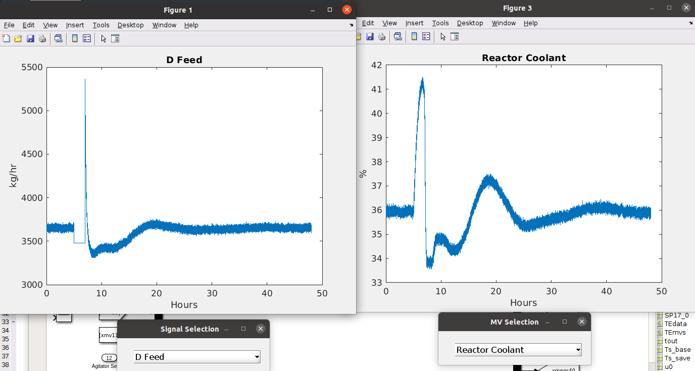

## TEP Attack Simulator

This repository contains files to run a manipulated version of the Tennesee Eastman Process (TEP) -- an ICS simulator.  
This simulator is heavily based on two prior iterations, which may serve as useful references:
- [Tennesee Eastman MATLAB implementation (2015)](https://depts.washington.edu/control/LARRY/TE/download.html)
- [DVCP-TE (2015)](https://github.com/satejnik/DVCP-TE)

This simulator contains modifications to the original MATLAB implementation, which allows the user to inject manipulations into the TE process, and observe/record their impacts.

The outputs of this simulator are used in the paper: "Attributions for ML-based ICS anomaly detection: From theory to practice", 
to appear at the 31st Network and Distributed System Security Symposium (NDSS 2024).

### Bibtex

```
@inproceedings{icsanomaly:ndss2024,
  title = {Attributions for {ML}-based {ICS} Anomaly Detection: {From} Theory to Practice},
  author = {Clement Fung and Eric Zeng and Lujo Bauer},
  booktitle = {Proceedings of the 31st Network and Distributed System Security Symposium},
  publisher = {Internet Society},
  year = 2024,
}  
```

### Dependencies
Like the original TEP implementation, our simulator is built in MATLAB Simulink.  
For our experiments, we use [MATLAB R2021a](https://www.mathworks.com/products/new_products/release2021a.html).

### Step-by-step demo instructions
A full set of instructions, with screenshots, can be found in [the demo instructions](demo-instructions.md).  
The final outcomes of the demo are shown below.

| Benign simulation result | Attack simulation result (manipulating D Feed sensor) |
| --- | --- |
|||

### Access to the complete dataset
As described in our paper, we use the simulator to execute each attack condition (location, magnitude, pattern) in the TE process.  
The full set of 286 manipulations can be found here: [https://doi.org/10.1184/R1/23805552](https://doi.org/10.1184/R1/23805552).
