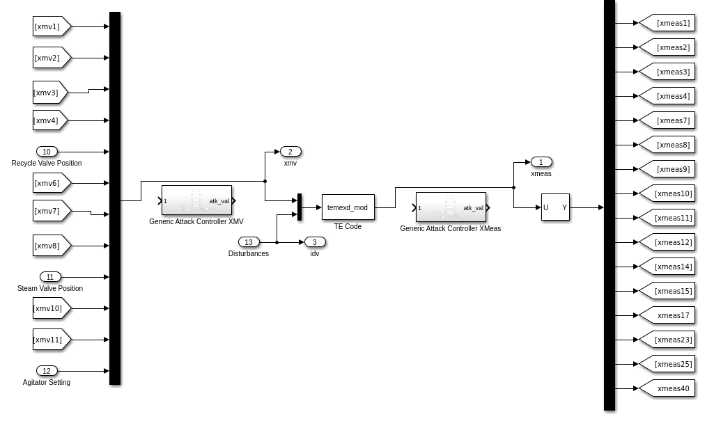
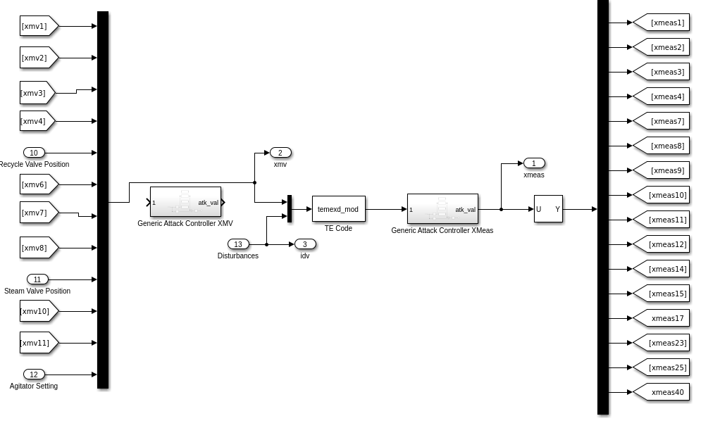
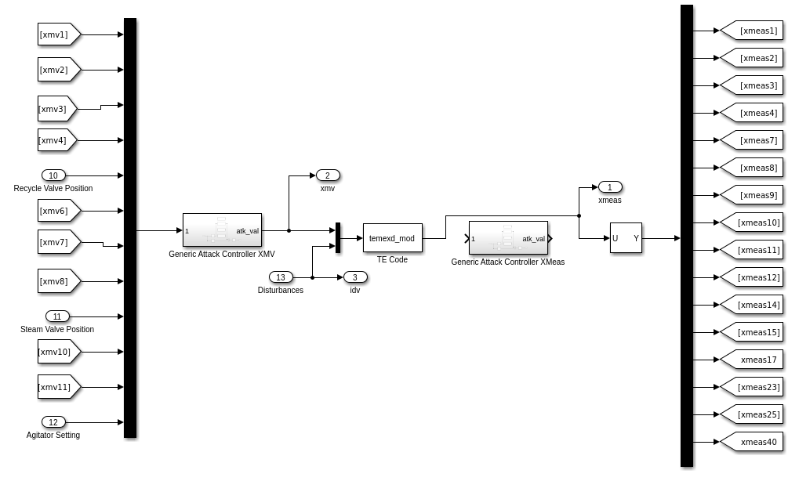
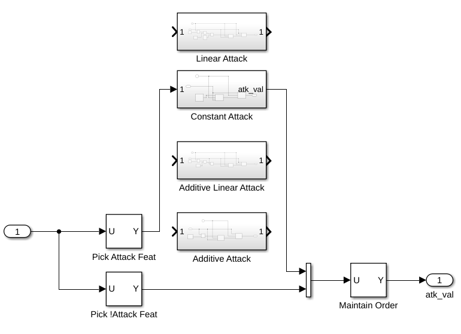
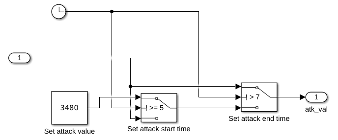
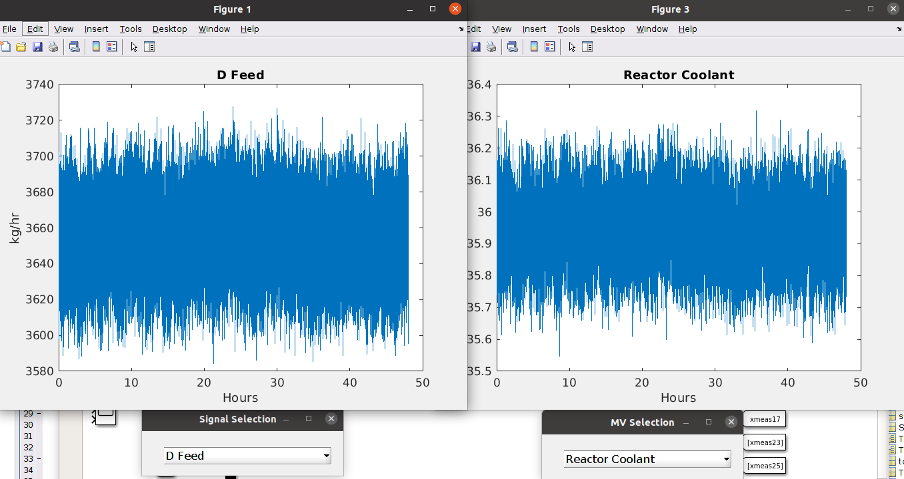
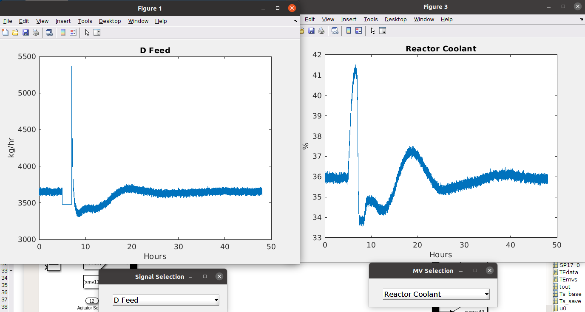

### Opening the environment
1. After cloning this repository, load MATLAB, and set the MATLAB workspace to `temexd_mod`.
2. Initialize the environment by executing `Mode_1_Init.m`.
3. Open the Simulink environment: `MultiLoop_mode1.mdl`.

### Configuring the environment
The default configuration of the environment will show the system in a benign state.
| Benign Simulator State |
|---|
||

To execute an attack, modify the Simulink arrows such that the inputs or outputs of the `temexd_mod` process pass through one of the attack controllers.
| Attacking sensors | Attacking XMVs (actuators) |
| --- | --- |
|||

Double click the attack controller to configure how the attack is performed. Our demo uses the `Generic Attack Controller XMeas` to manipulate a sensor value.  
To modify which feature is attacked, modify the `Pick Attack Feat`, `Pick !Attack Feat`, and `Maintain Order` modules to select the desired feature from the input.
Since the TE process expects the feature ordering to be the same, when writing the manipulated feature value back to the output, the indices must be re-ordered correctly.
| Configuring attack location |
|---|
||

To execute a constant manipulation, double click the `Constant Attack` module.
The start, end and set-point values can be configured within this module.
| Configuring attack value |
|---|
||

To execute the manipulation, press the Run button in Simulink.  
Our experiments were conducted with a Stop Time of 48.

### Processing the simulation results

A plotting module will open when the simulation has completed. 
Use the dropdown menu to select different sensors and actuators (MVs).

| Benign simulation result | Attack simulation result (manipulating D Feed sensor) |
| --- | --- |
|||

To save the simulation outputs to a readable format, we use the following Matlab commands to save the simulation sensors and acuators:
```
csvwrite('simout_example.csv', simout)
csvwrite('xmv_example.csv', xmv)
```

